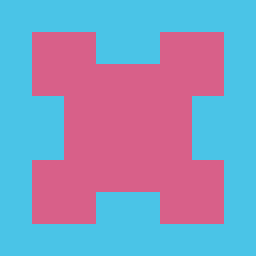

# Eternity 2 playground

Python scripts for playing and analyzing Eternity 2 puzzle. It contains a backtracking algorithm but it is mostly for educiational purposes (writing one in C/C++ would be much more efficient).

# Patterns representation
For the main puzzle and also automatically generated variants we use same patterns. These are generated by script to match the original patterns. Following are numerical values of the patterns for reference.

Note that in the original puzzle the patterns on a border are different from those in the inside.

|  Border Pattern | Value      |
| ----------- | ----------- |
| None (border) |0 | 
|  |1 | 
|  |2 | 
|  |3 | 
|  |4 | 
|  |5 |

|  Inner Pattern | Value    | Inner Pattern | Value      |
| ----------- | ----------- | ----------- | ----------- |
|  |6 |  |15 | 
|  |7 |  |16 | 
|  |8 |  |17 | 
|  |9 |  |18 | 
|  |10 |  |19 | 
|  |11 |  |20 | 
|  |12 |  |21 | 
|  |13 |  |22 | 
|  |14 |   | 

For patterns generation script see [generate_color.py](./data/eternity2/generate_color.py) 

The generated variants of edge puzzles might use any of these for border and internal sides (also additional patterns can be generated by the script above if needed).

# Pieces definition

Pieces are defined by their numbers and patterns in following order of world directions: E (east), S (south), W (west) and N (north). For example the piece 139 is defined as 

`139,14,8,8,9`

So in the default orientation we have E=14, S=8, W=8 and N=9.

Pieces definitions for the original puzzle can be found in [eternity2_256.csv](./data/eternity2/eternity2_256.csv).

# Hints definition

Hints are defined by their top coordinate, right coordinate, piece number and rotation offset (number 0,1,2 or 3, indicating number of 90 clockwise degree turns). For example the hint piece is defined as

`8,7,139,3`

So the piece 139 is placed at the 8 (indexed from 0) from top and 7 position from right. The rotation offset is 3, so by rotating the default (14,8,8,9) clockwise, it will be placed as (8,8,9,14).

Hints definitions for the original puzzle can be found in [eternity2_256_hints.csv](./data/eternity2/eternity2_256_hints.csv).

# Dependencies

Install Python dependencies using

`python -m pip install -r requirements.txt`

# Run

There are various useful utility scripts to run. Following are some examples.

Show list of pieces from definition:

`python show_pieces.py -conf data/eternity2/eternity2_256.csv`

Show list of hints:

`python show_pieces.py -conf data/eternity2/eternity2_256.csv -hints data/eternity2/eternity2_256_hints.csv`

Try solving the puzzle yourself by swapping individual pieces:

`python play.py -conf data/eternity2/eternity2_256.csv -hints data/eternity2/eternity2_256_hints.csv`

All pieces are on board, you can use following keys:

| key | function |
| --- | --- |
| i | show/hide pieces numbers   |
| mouse left click | select source/destination piece for swap   |
| mouse right click | rotate the selected piece   |

Note that after swapping two pieces, the game might currently automatically apply the best rotation (to maximize score)

Run basic backtracker (super slow!):

`python backtracking.py -conf data/eternity2/eternity2_256.csv -hints data/eternity2/eternity2_256_hints.csv`
