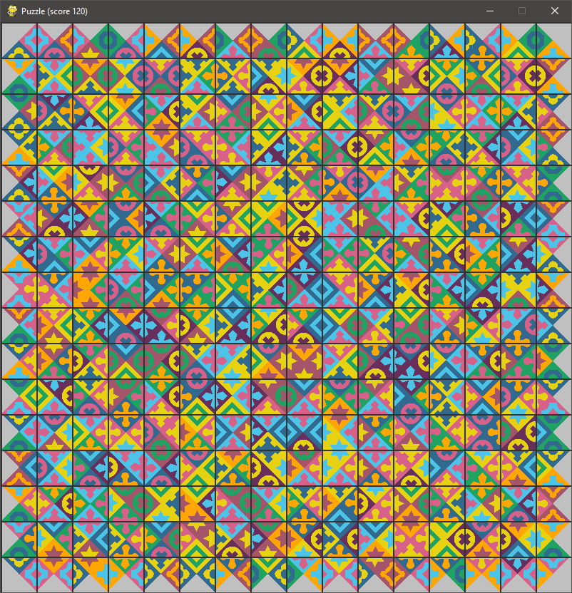
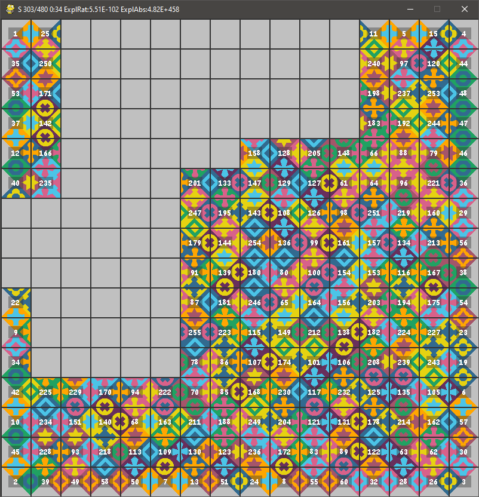

# Eternity 2 playground

Python scripts for playing and analyzing Eternity 2 puzzle. It contains a backtracking algorithm, but it is mostly for educational purposes. There is also C/C++ version of some backend tools such as backtraker and swapper (work in progress.

# Patterns representation
For the main puzzle and also automatically generated variants we use same patterns. These are generated by script to match the original patterns. Following are numerical values of the patterns for reference.

Note that in the original puzzle the patterns on a border are different from those in the inside.

|  Border Pattern | Value   |
| ----------- | ----------- |
| None (border) |0 | 
|  |1 | 
|  |2 | 
|  |3 | 
|  |4 | 
|  |5 |

|  Inner Pattern | Value    | Inner Pattern | Value      |
| ----------- | ----------- | ----------- | ----------- |
|  |6 |  |15 | 
|  |7 |  |16 | 
|  |8 |  |17 | 
|  |9 |  |18 | 
|  |10 |  |19 | 
|  |11 |  |20 | 
|  |12 |  |21 | 
|  |13 |  |22 | 
|  |14 |   | 

For patterns generation script see [generate_pattern.py](data/patterns/generate_pattern.py) . The individual piece images are then generated dynamically on runtime from the patterns images and pieces definition.

The generated variants of edge puzzles might use any of these for border and internal sides (also additional patterns can be generated by the script above if needed).

# Pieces definition

Pieces are defined by their numbers and patterns in following order of world directions: E (east), S (south), W (west) and N (north). For example the piece 139 is defined as 

`139,14,8,8,9`

So in the default orientation we have E=14, S=8, W=8 and N=9.

Pieces definitions for the original puzzle can be found in [eternity2_256.csv](./data/eternity2/eternity2_256.csv).

# Hints definition

Hints are defined by their top coordinate, left coordinate, piece number and rotation offset (number 0,1,2 or 3, indicating number of 90 clockwise degree turns). For example the hint piece is defined as

`8,7,139,3`

So the piece 139 is placed at the 8 (indexed from 0) from top and 7 position from left. The rotation offset is 3, so by rotating the default (14,8,8,9) clockwise, it will be placed as (8,8,9,14).

Hints definitions for the original puzzle can be found in [eternity2_256_hints.csv](./data/eternity2/eternity2_256_hints.csv).

# Dependencies

Install Python dependencies using

`python -m pip install -r requirements.txt`

# Run

There are various useful utility scripts to run. Following are some examples.

Show list of pieces from definition:

`python show_pieces.py -conf data/eternity2/eternity2_256.csv`

Show list of hints:

`python show_pieces.py -conf data/eternity2/eternity2_256.csv -hints data/eternity2/eternity2_256_hints.csv`

Try solving the puzzle yourself by swapping individual pieces:

`python play.py -conf data/eternity2/eternity2_256.csv -hints data/eternity2/eternity2_256_hints.csv`

All pieces are placed on board. You can use following keys:

| key | function |
| --- | --- |
| i | show/hide pieces numbers   |
| mouse left click | select source/destination piece for swap   |
| mouse right click | rotate the selected piece   |

Note that after swapping two pieces, the game might currently automatically apply the best rotation (to maximize score)

Run basic backtracker (super slow!):

`python backtracking.py -conf data/eternity2/eternity2_256.csv -hints data/eternity2/eternity2_256_hints.csv`

You can use following keys:

| key | function |
| --- | --- |
| i | show/hide pieces numbers   |
| s | save the current board state to a file |

Some additional backtracker features:

 - The search doesn't go just horizontally/vertically as usually, instead it selects the position with minimal number of possibilities at given time.
 - Constraint reduction is used before choosing next position to reduce number of required positions to check. If, for example, we have three pieces x1, x2, x3 and positions P1, P2, P3, where set of possible pieces in that positions are P1={x1,x2}, P2={x1,x2} and P3={x1,x2,x3}. Such constraint would be reduced into P1={x1,x2}, P2={x1,x2}, P3={x3}, so x3 will be placed to P3 next (of course in practice much more complicated scenarios arise).
 - Calculation of visited nodes in the search space, see ExplRat(io) and ExplAbs in the window title
 - Flag for finalizing of the board by placing remaining pieces if number of placed pieces gets above certain threshold (the rest can be improved by running swapping algorithm on the result)

Run swapping algorithm on saved position (maximizes the current board score by swapping pieces):

`python swapping.py -conf data/eternity2/eternity2_256.csv -hints data/eternity2/eternity2_256_hints.csv -load [saved csv file]`

The algorithm uses some heuristics for move choice, but it seems to be reliably reaching score above 400 from random position. It can be also usually used to slightly improve scores of previously reached states.

Finally you can also try not very effective genetic algorithm:

`python genetic_algorithm.py -conf data/eternity2/eternity2_256.csv -hints data/eternity2/eternity2_256_hints.csv`

It is also possible to generate custom puzzles (thus having known solution, useful for analyzes/trainings):

`python puzzle_generator.py`

By default, it generates a puzzle with same characteristics as the original Eternity 2 puzzle (board height, width, and number of individual inner patterns). This can be changed via parameters (see `python puzzle_generator.py -help`).

# C++ backend (in progress)

Currently there is single solution for both backtracker/swapper (will be likely split later) stored in /core_cpp folder. It has dependency on MPIR library for arbitrary precision arithmetic (used only for explored space statistic calculation)..